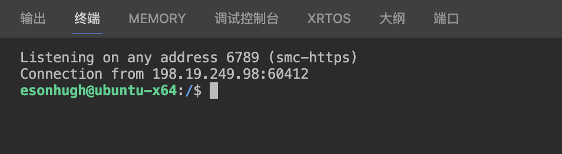

## Demo of usage

### Tasks

#### msfvenom payload generate

1. Ctrl+Shift+P to open command palette

2. select `Tasks: Run Task` and select `msfvenom-payload-creating`

3. input options for payload

4. generate payload

### Terminals 

using 

#### normal zsh injected env

direct use `+` to init the default zsh shell

and you will got the env defined in `env.zsh` and `source.zsh` 

you can do thing like 

use env var in command  

fast folder jumping 

#### meterpreter handler

use `meterpreter-handler` to init the msfconsole with the rcfile

 

#### netcat handler

##### netcat + rlwrap (default)

use `netcat-handler` to init the netcat listener

(you know the 6789 port is default $LPORT in `env.zsh`, I just reuse it in `revshell.zsh`)

and victim using payload to reverse its shell 

and gain the shell

##### pwncat-cs 

just replace payload in `revshell.zsh` with pwncat-cs

and trigger shell on remote 

gain shell with pwncat 

and then do anything you need.

#### web delivery

use `web-delivery` to init the http server in the project folder, default is in the $PROJECT_WEB_DELIVERY

1. starting http server with `web-delivery` terminal

2. copy available payloads or scripts to $PROJECT_WEB_DELIVERY

3. vicitim get payload via http

4. attacker get the request log in the terminal

> ur can use such function get xss result as well. 

#### macos kali orbstack vm with injected env

