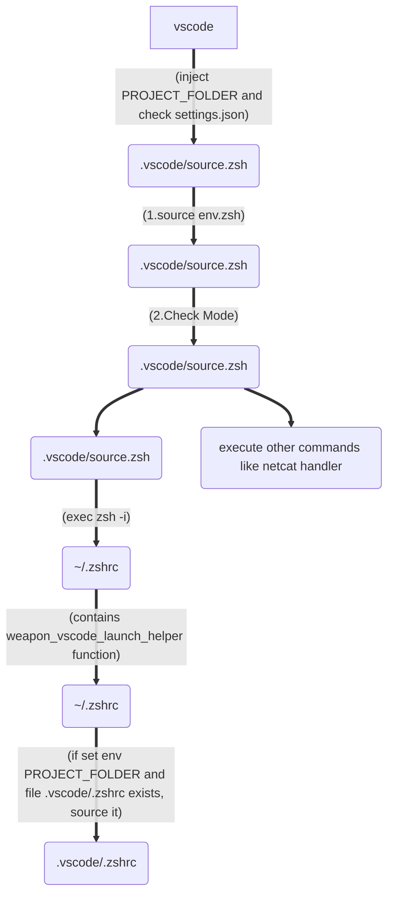

# all zsh file launch order

```mermaid
graph TD;

vscode ==(inject PROJECT_FOLDER and check settings.json)==> source.zsh(.vscode/source.zsh)
source.zsh ==(1.source env.zsh)==> source.zsh_enved(.vscode/source.zsh)  ==(2.Check Mode)==> source.zsh_mode(.vscode/source.zsh) ==> source.zsh_call_zsh(.vscode/source.zsh) & node(execute other commands like netcat handler)
source.zsh_call_zsh(.vscode/source.zsh) ==(exec zsh -i)==> home_zshrc(~/.zshrc)
home_zshrc ==(contains weapon_vscode_launch_helper function)==> home_zshrc_call_helper(~/.zshrc)
home_zshrc_call_helper ==(if set env PROJECT_FOLDER and file .vscode/.zshrc exists, source it)==> execute_project_folder_zshrc(.vscode/.zshrc)
```